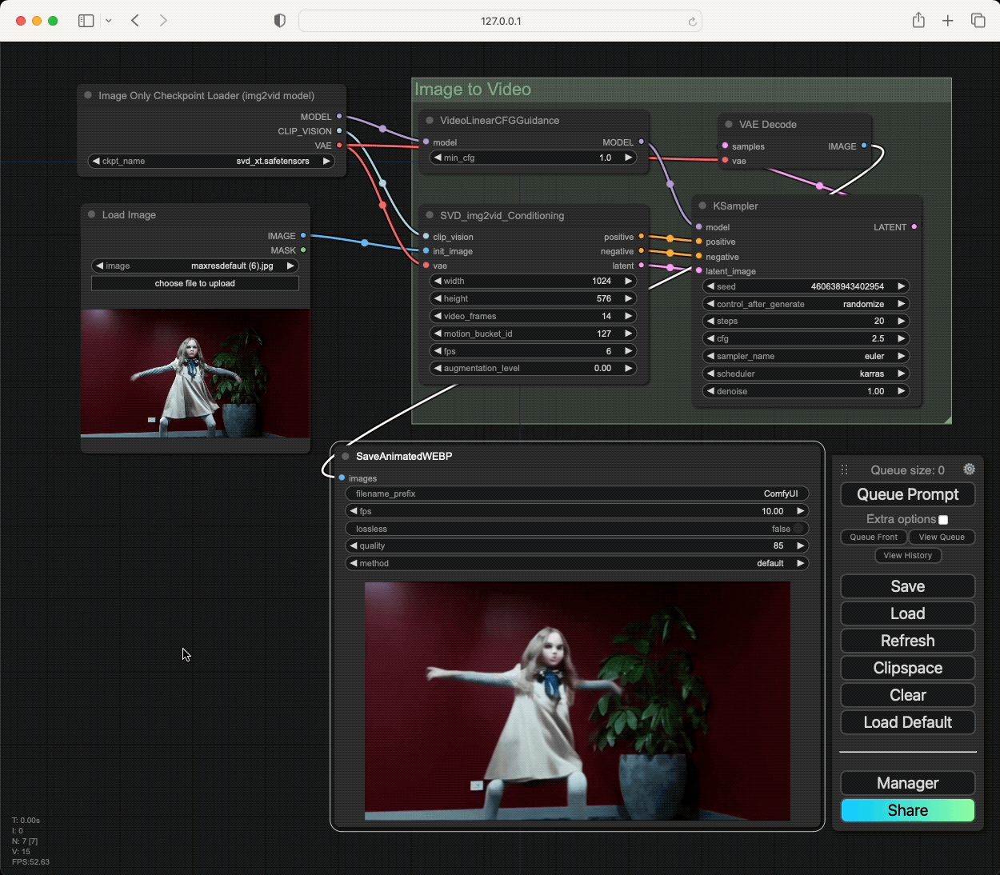

# How to install and run Stable Video on a Mac



This document explains everything you need to know about installing and running Stable Video on a Mac, with [ComfyUI](https://github.com/comfyanonymous/ComfyUI).

1. **Manual Install**
2. **One Click Install**
3. **Running on Intel Macs**

## 1. Manual Install

Let's first take a look at how to install ComfyUI in a way that supports Stable Video, on your Mac.

First, open your terminal and install ComfyUI with a custom torch.

> This custom torch install from git is needed in order to support Conv3D for MPS (https://github.com/pytorch/pytorch/pull/114183)

```
# download comfyui
git clone https://github.com/comfyanonymous/ComfyUI
cd ComfyUI

# create a virtual environment
python -m venv env
source env/bin/activate env

# install dependencies
pip install -r requirements.txt
pip install git+https://github.com/pytorch/pytorch@refs/pull/114183/head torchvision torchaudio
```

Then, download the SVD-XT checkpoint at https://huggingface.co/stabilityai/stable-diffusion-xl-base-1.0/resolve/main/sd_xl_base_1.0.safetensors into `ComfyUI/models/checkpoints`

Then, launch the app:

```
# activate the virtual environment (can skip this if you're already activated)
cd ComfyUI
source env/bin/activate env

# run with --force-fp16
python main.py --force-fp16
```

Finally, load a video workflow into ComfyUI.

There are many ways to do this, but the most basic way is to drag and drop the image (which embeds the workflow) into the ComfyUI interface https://raw.githubusercontent.com/comfyanonymous/ComfyUI_examples/master/video/image_to_video.webp

Now you're set to go!

## 2. One Click Install

What if I told you, all of the above can be automated with one click, without ever touching the terminal?

The easiest way to install is by using [Pinokio](https://pinokio.computer), **a free and open source AI browser that lets you browse, install, and run all kinds of AI projects** such as Stable Diffusion, Text Generation WebUI, Facefusion, and so on.

To install ComfyUI to support Stable Video, just get Pinokio and install ComfyUI from this link: https://pinokio.computer/item?uri=https://github.com/cocktailpeanut/comfyui.pinokio (or you can find on Pinokio's discover page).

To learn more,

Read the following thread: https://x.com/cocktailpeanut/status/1728075614807048208?s=20

Or watch the Youtube video:

[](https://www.youtube.com/watch?v=37_DzIG0Ows)


## 3. Running on Intel Macs

This is not really recommended since it's too slow (Takes hours to generate a single video), but I will share just for the sake of completeness:

### Running Manually

When running in terminal, simply launch the app with a `--cpu` flag.

```
# activate the virtual environment (can skip this if you're already activated)
cd ComfyUI
source env/bin/activate env

# run with --cpu
python main.py --cpu
```

### Running with Pinokio

When using Pinokio, you can just launch the app using "Launch in CPU mode".
